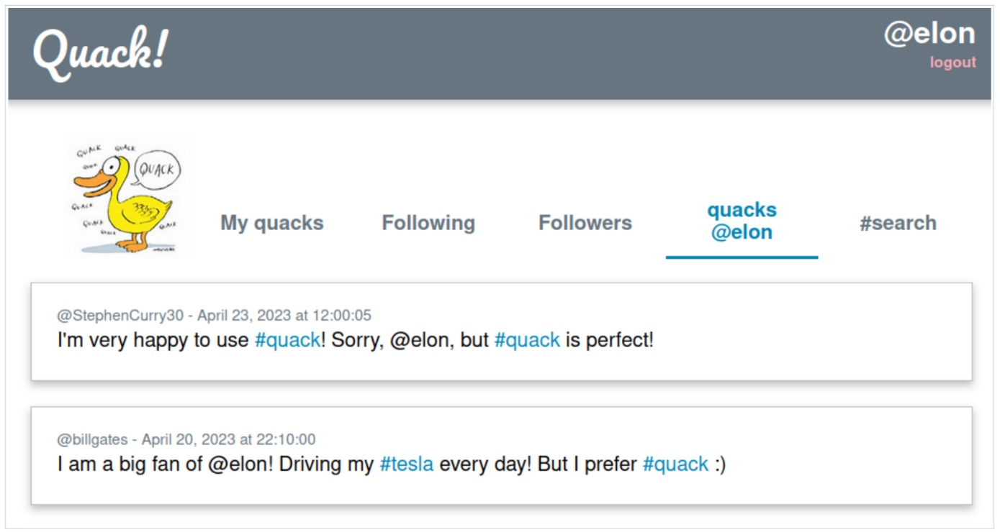

# Quack: A Simple Social Media Web Application

This repository contains a PHP-based web application implementing the "Quack" platform, designed as a university assignment for the "Computer Lab II" course. Quack is a lightweight social media application that allows users to share short posts, follow others, and explore tagged content.

## Features

- **User Functionality**:
  - Post short messages (quacks) with a maximum length of 140 characters.
  - Use hashtags (#tag) and mentions (@username) within posts.
  - Follow or unfollow other users.
  - View quacks that mention your username.
  - Filter quacks by specific hashtags.

- **Database-Driven Application**:
  - Users, posts, and follow relationships are managed through MySQL tables.
  - Includes functionality for initializing database tables with `prepareDB.php`.

- **Interactive Views**:
  - View all your quacks and create new ones.
  - View quacks from users you follow.
  - Manage your follow list by adding or removing users.
  - See all users following you.
  - Search and view quacks containing specific hashtags.

- **Additional Features**:
  - Posts are displayed in descending order of posting time.
  - Hashtags are rendered as clickable links to filtered views.
  - Secure login and logout functionality.
  - Hashtags rendered as clickable links for easy navigation.

## Setup Instructions

1. **Database Initialization**:
   - Configure database connection details in `prepareDB.php`.
   - Execute the script to create the required tables:
     - `dz2_users`: Stores user data.
     - `dz2_follows`: Tracks follow relationships.
     - `dz2_quacks`: Stores quack posts.

2. **Deployment**:
   - Upload the application files to a PHP-enabled web server.

3. **File Permissions**:
   - Set directory permissions to `701` (`rwx-----x`) for security.

## Technical Notes

- Uses MySQL for data persistence.
- Avoids JavaScript; all interactivity is handled via PHP.

## Potential Improvements

- **User Registration System**: Allow new users to register accounts directly within the application, enhancing usability and functionality.
- **Enhanced Navigation**: Introduce pagination for better handling of large numbers of quacks.
- **Real-Time Updates**: Integrate live updates for new quacks using AJAX.
- **Search Enhancements**: Add advanced search capabilities, such as filtering by date range or multiple hashtags.
- **Profile Customization**: Enable users to add profile pictures or descriptions for a more personalized experience.
- **Mobile Responsiveness**: Improve the design for better compatibility with mobile devices.

## How to Use

1. **Log In**:
   - Users log in with their username and password.

2. **Explore Features**:
   - Create quacks using a simple text box.
   - View quacks from followed users or mentioning your username.
   - Filter quacks by specific hashtags.
   - Manage your follow list by adding or removing users.

3. **Navigation**:
   - Posts are sorted by date, with the newest first.
   - Clickable hashtags simplify navigation to related posts.

## Additional Information

This project was completed in April 2023 as part of a university course. The goal was to demonstrate database integration, PHP scripting, and web application development principles.

## License

This project is provided for educational purposes only and is not associated with any formal licensing.
